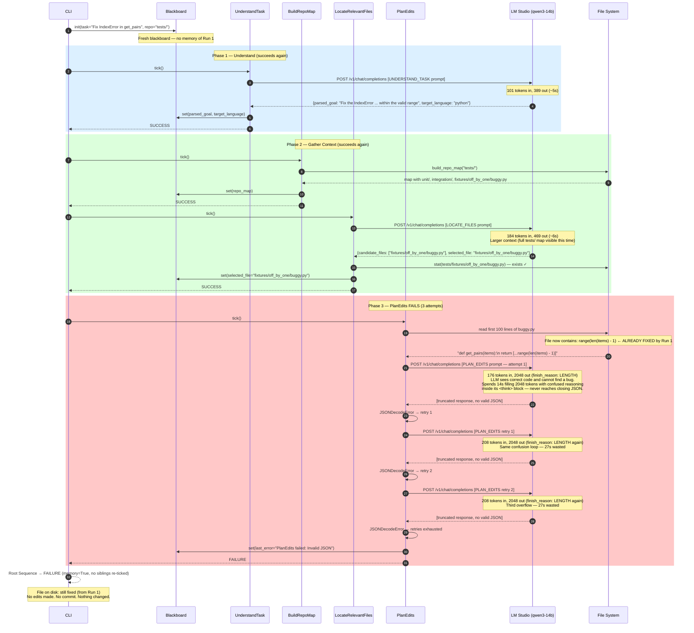

# bt-agent Run Report: `Fix the IndexError in get_pairs`

**Date:** 2026-03-03
**Model:** `qwen/qwen3-14b` via LM Studio
**Repo under test:** `tests/` (working directory: `~/bt_coding2`)
**Fixture file:** `tests/fixtures/off_by_one/buggy.py`

---

## 1. Executive Summary

Two back-to-back invocations of `bt-agent run` against the same repo produced two different failures, for two completely different reasons. The table below summarises the outcome:

| Run | Time  | Final Status | Root Cause |
|-----|-------|-------------|------------|
| 1   | 19:17 | `FAILURE`   | `GitCommit` failed — `tests/` is not a git repo. The file edit *was* applied successfully before the failure. |
| 2   | 19:23 | `FAILURE`   | `PlanEdits` failed — the fixture was already fixed by Run 1; the LLM exhausted its 2048-token budget (`finish_reason: length`) reasoning about code that had no bug. |

Run 1 is a **partial success with a commit-layer failure** — the mutation was applied but not committed, leaving the repo in a dirty state.
Run 2 is an **idempotency failure** — the agent has no guard to detect that the task is already done.

---

## 2. Behavior Tree Structure

The tree is a single root `Sequence` with `memory=True`. Once any child returns `FAILURE`, the root stops and propagates failure upward without retrying prior siblings.

```
{Sequence/memory} Root
    [Action]  UnderstandTask          ← LLM: parse task → parsed_goal, target_language
    {Sequence/memory} GatherContext
        [Action]  BuildRepoMap        ← Pure Python: walk fs → repo_map
        [Action]  LocateRelevantFiles ← LLM: repo_map + goal → selected_file
    [Action]  PlanEdits               ← LLM: file preview + goal → edit_plan, edit_intent
    {Decorator} EditLoop (RetryUntilSuccess, max=5)
        {Sequence/memory} EditAttempt
            [Action]  ReadTargetFile  ← Pure Python: read file → current_file_content
            [Action]  GenerateEdit    ← LLM: content + plan → proposed_edit (str_replace)
            [Action]  ApplyEdit       ← Pure Python: str_replace on disk
            [Action]  ValidateEdit    ← Pure Python: pyflakes/ast lint
    {Sequence/memory} CommitChanges
        [Action]  GenerateCommitMsg   ← LLM: intent → commit message string
        [Action]  GitCommit           ← Pure Python: git stage + commit (or dry-run)
```

**Legend:**
- `{Sequence/memory}` — a sequence that remembers success; a single child failure short-circuits the rest
- `{Decorator}` — wraps a child, re-running it up to `max_failures` times before propagating failure
- `[Action]` — leaf node; does one unit of work and returns `SUCCESS` or `FAILURE`

---

## 3. Run 1 Sequence Diagram (19:17) — Edit applied, commit fails


---

## 4. Run 2 Sequence Diagram (19:23) — PlanEdits drowns in confusion



---

## 5. Leaf Node Performance Analysis

Each leaf node is evaluated independently below. Nodes not reached in a run are marked **N/R**.

### 5.1 `UnderstandTask` — LLM leaf

| Run | Tokens (in/out) | Latency | Status | Notes |
|-----|----------------|---------|--------|-------|
| 1   | 101 / 484      | ~6s     | ✅ SUCCESS | Correctly parsed goal and language. Slight verbosity in `<think>` block but valid JSON produced. |
| 2   | 101 / 389      | ~5s     | ✅ SUCCESS | Slightly more concise reasoning, same correct output. |

**Assessment:** Robust. The prompt is narrow and well-constrained. The model has no ambiguity about what a "task description" is, and the output schema is simple (2 fields).

---

### 5.2 `BuildRepoMap` — Pure Python leaf

| Run | Status | Notes |
|-----|--------|-------|
| 1   | ✅ SUCCESS | Walked `tests/` directory tree. No LLM, no network — deterministic. |
| 2   | ✅ SUCCESS | Same. |

**Assessment:** Perfectly reliable. This is a pure filesystem traversal with no external dependencies.

---

### 5.3 `LocateRelevantFiles` — LLM leaf

| Run | Tokens (in/out) | Latency | Status | Notes |
|-----|----------------|---------|--------|-------|
| 1   | 130 / 271      | ~3s     | ✅ SUCCESS | Returned `selected_file: "buggy.py"` — a path *relative to the fixture directory*, not `tests/`. This worked because the file existence check passed (the node resolves against `repo_path`). |
| 2   | 184 / 469      | ~6s     | ✅ SUCCESS | Returned `selected_file: "fixtures/off_by_one/buggy.py"` — the full path relative to `tests/`. The larger repo map (more files visible) prompted a more precise path. |

**Assessment:** Works, but non-deterministic in path format. The model returned different relative path styles across runs depending on what context was in the repo map. The existence check in `gather.py:47` (`selected.exists()`) is a good guard but the inconsistency in path resolution is a latent bug if a future run returns an ambiguous short name.

---

### 5.4 `PlanEdits` — LLM leaf ⚠ KEY FAILURE POINT

| Run | Tokens (in/out) | Latency | Attempts | Status | Notes |
|-----|----------------|---------|----------|--------|-------|
| 1   | 165 / 1088     | ~14s    | 1        | ✅ SUCCESS | File was buggy. LLM correctly identified off-by-one and produced a clean plan. Token budget was high but used productively in `<think>`. |
| 2   | 176→208→208 / 2048×3 | ~80s | 3 | ❌ FAILURE | File was already fixed. LLM saw `range(len(items) - 1)` (correct code), could not rationalise why a bug existed, and spent all 2048 tokens inside `<think>` without ever emitting valid JSON. `finish_reason: length` on all three attempts. |

**Root cause:** `max_tokens=2048` is shared between the model's extended reasoning (`<think>`) and the final JSON output. When the model becomes confused, it reasons indefinitely — the JSON output never arrives because the context window is consumed first.

**Assessment:** This is the critical failure node. See Section 7 for remediation.

---

### 5.5 `ReadTargetFile` — Pure Python leaf

| Run | Status | Notes |
|-----|--------|-------|
| 1   | ✅ SUCCESS | Read buggy content correctly, stored in `current_file_content`. |
| 2   | N/R — not reached | PlanEdits failed upstream. |

**Assessment:** Reliable — pure I/O. The only failure mode is a missing file, which is already guarded.

---

### 5.6 `GenerateEdit` — LLM leaf

| Run | Tokens (in/out) | Latency | Status | Notes |
|-----|----------------|---------|--------|-------|
| 1   | 278 / 68       | ~1s     | ✅ SUCCESS | Minimal thinking, clean and fast. The real bug provided unambiguous context. Produced an exact `str_replace` match in one shot. |
| 2   | N/R            | —       | —      | — |

**Assessment:** Performed excellently when given a real bug. The extremely low token output (68) indicates the model found the fix immediately with no false starts. The retry mechanism with `GENERATE_EDIT_RETRY_ADDITION` was not needed.

---

### 5.7 `ApplyEdit` — Pure Python leaf

| Run | Status | Notes |
|-----|--------|-------|
| 1   | ✅ SUCCESS | `str_replace` found the exact substring and replaced it. File written to disk. |
| 2   | N/R | — |

**Assessment:** Reliable. The `str_replace` approach requires an exact substring match, which is an appropriate constraint — it prevents hallucinated edits from being applied silently.

---

### 5.8 `ValidateEdit` — Pure Python / linter leaf

| Run | Status | Notes |
|-----|--------|-------|
| 1   | ✅ SUCCESS | Python AST/pyflakes validation passed. No syntax errors introduced. |
| 2   | N/R | — |

**Assessment:** Good safety net. The rollback on lint failure (`path.write_text(self.bb.current_file_content)`) is correct defensive programming. However, it only catches syntax errors — semantic correctness (e.g. wrong index formula) would pass lint even if the logic were still wrong.

---

### 5.9 `GenerateCommitMsg` — LLM leaf

| Run | Tokens (in/out) | Latency | Status | Notes |
|-----|----------------|---------|--------|-------|
| 1   | 117 / 162      | ~2s     | ✅ SUCCESS | Produced a well-formed conventional commit message on first attempt. |
| 2   | N/R            | —       | —      | — |

**Assessment:** Reliable for this task. The prompt is tightly constrained (one-line, under 72 chars, conventional format). The length guard in `commit.py:28` (`len(text) > 200`) is appropriate.

---

### 5.10 `GitCommit` — Pure Python leaf

| Run | Status | Notes |
|-----|--------|-------|
| 1   | ❌ FAILURE | `stage_and_commit` failed because `tests/` is not a git repository. This is a **configuration error** (wrong `--repo` path), not a logic bug in the agent. The edit was already on disk when this failed. |
| 2   | N/R | — |

**Assessment:** Works correctly when given a valid git repo. The failure here is environmental — the user ran the agent against `tests/` instead of the project root or a git-initialised fixture. The tree provides no rollback mechanism for the case where the edit is applied but the commit fails.

---

## 6. Why Run 2 Failed: Full Analysis

### 6.1 The Idempotency Problem

The agent has no concept of "is this task already done?" It assumes at startup that the described task is *pending*. When `PlanEdits` receives a file that is already correct, it passes that file to the LLM with the instruction to produce a plan for fixing it. The LLM has no mechanism to say "there is nothing to fix" — it is compelled by the prompt to produce a JSON plan.

This creates a pathological failure mode:

```
Task: "Fix the IndexError in get_pairs"
File content: range(len(items) - 1)   ← already correct

Model's dilemma:
  The task says there IS a bug.
  The code shows there IS NOT a bug.
  → Model cannot reconcile this contradiction.
  → Model reasons indefinitely in <think>.
  → finish_reason: length (2048 tokens exhausted).
  → No JSON ever emitted.
  → JSONDecodeError → retry → same outcome × 3.
```

### 6.2 The Token Budget Problem

`LLMClient` is constructed with `max_tokens=2048`. This ceiling is shared between:
1. The model's chain-of-thought (`<think>...</think>`)
2. The actual JSON output

Qwen3-14b uses extended thinking by default and will fill all available budget with reasoning when confused. With `max_tokens=2048`, there is frequently not enough space left over for the JSON payload — particularly when the model cannot resolve an internal contradiction.

`finish_reason: length` appearing on all three `PlanEdits` attempts is the definitive indicator that the model never reached its stopping point naturally.

### 6.3 The Dirty State Problem (Run 1)

Run 1 left the repository in a dirty state:
- The file was edited on disk
- `GitCommit` failed (non-git directory)
- No rollback occurred
- The blackboard had `committed=False` but no cleanup was triggered

On Run 2, the agent encountered this modified file with no knowledge that it was the artifact of a prior incomplete run.

---

## 7. Remediation

### 7.1 Canonical Behavior Tree Approach

The canonical solution in behavior tree design is a **precondition guard** — a condition node placed before the work subtree that checks whether the task is already satisfied. If the condition is already true, the subtree is skipped and the tree returns `SUCCESS` immediately (idempotent).

In behavior tree theory, this pattern is called a **"check-then-act"** structure:

```
{Sequence} Root
    [Condition] IsBugPresent          ← NEW: detect if the described bug exists
    [Action]    UnderstandTask
    {Sequence}  GatherContext
        [Action] BuildRepoMap
        [Action] LocateRelevantFiles
    [Action]    PlanEdits
    ...
```

However, checking for a bug requires knowing what to look for — which is circular (you need the LLM to understand the task first). A more practical structure places the guard *after* `GatherContext`, once the file is known:

```
{Sequence/memory} Root
    [Action]    UnderstandTask
    {Sequence}  GatherContext
        [Action] BuildRepoMap
        [Action] LocateRelevantFiles
    [Condition] IsEditNeeded          ← NEW: ask LLM "does this file need changing?"
    [Action]    PlanEdits
    {Decorator} EditLoop
        {Sequence} EditAttempt
            [Action] ReadTargetFile
            [Action] GenerateEdit
            [Action] ApplyEdit
            [Action] ValidateEdit
    {Sequence}  CommitChanges
        [Action] GenerateCommitMsg
        [Action] GitCommit
```

`IsEditNeeded` is a lightweight LLM call:

```
System: "You are a code reviewer."
User:   "Given this task and this file content, does the file need to be changed?
         Respond ONLY with JSON: {\"needs_edit\": true/false, \"reason\": \"...\"}"
```

If `needs_edit: false`, the condition node returns `FAILURE`, the root sequence short-circuits, and the tree exits cleanly with `FAILURE` (or a dedicated `SUCCESS` via a `Fallback` / `Selector` wrapping the sequence).

A cleaner BT composition uses a **Selector** at the root to represent "either the task was already done, or we do it now":

```
{Selector} Root
    [Condition] IsTaskAlreadyComplete   ← succeeds immediately if nothing to do
    {Sequence}  DoTheWork
        [Action] UnderstandTask
        {Sequence} GatherContext
            ...
        [Action] PlanEdits
        ...
```

#### Defensive Guard: PlanEdits Token Budget

Independently of the idempotency guard, `PlanEdits` should be hardened against token overflow:

1. **Separate `max_tokens` for planning vs. generation**: Planning calls need less budget than code generation. A dedicated `plan_max_tokens=512` leaves more room for reasoning while ensuring JSON is reachable.

2. **Detect `finish_reason: length`**: `LLMClient.call` returns a `LLMCallResult`. The raw LiteLLM response contains `choices[0].finish_reason`. If it equals `"length"`, the call should immediately be marked as a recoverable error rather than attempting JSON parse (which will always fail on a truncated response).

3. **Token budget split instruction**: Augment the `PLAN_EDITS_SYSTEM` prompt with:
   ```
   "Keep your reasoning concise — you have a limited token budget.
    Emit the JSON object as soon as your reasoning is complete."
   ```

#### Defensive Guard: Dirty State Rollback

When `GitCommit` fails after a successful `ApplyEdit`, the file has been mutated but not committed. The tree should include a **rollback decorator** around the edit + commit sequence:

```
{Sequence} EditAndCommit          ← NEW wrapper
    {Decorator} RollbackOnFailure ← restores current_file_content on failure
        {Sequence} EditLoop
            ...
    {Sequence} CommitChanges
        ...
```

`RollbackOnFailure` stores `current_file_content` before the edit and restores it if the wrapped subtree fails. This makes the agent's disk side-effects atomic relative to the commit.

---

### 7.2 Test Coverage Recommendations

The two failures expose two testing gaps: **idempotency** and **dirty-state handling**.

#### 7.2.1 Unit Tests for `PlanEdits`

```python
# tests/unit/test_nodes.py additions

def test_plan_edits_returns_failure_on_truncated_json(mock_bb, mock_llm):
    """PlanEdits must not hang or retry infinitely when finish_reason=length."""
    mock_llm.call.return_value = LLMCallResult(
        text="<think>lots of reasoning...",  # truncated — no closing tag, no JSON
        raw_response="...",
        prompt_tokens=208,
        completion_tokens=2048,
    )
    node = PlanEdits(mock_bb, mock_llm)
    status = node.update()
    assert status == py_trees.common.Status.FAILURE
    assert "Invalid JSON" in mock_bb.last_error


def test_plan_edits_succeeds_even_with_verbose_think_block(mock_bb, mock_llm):
    """Valid JSON after a long <think> block should still succeed."""
    mock_llm.call.return_value = LLMCallResult(
        text='<think>long reasoning...</think>\n{"edit_plan": "1. Fix range", "edit_intent": "Prevent IndexError"}',
        raw_response="...",
        prompt_tokens=200,
        completion_tokens=400,
    )
    node = PlanEdits(mock_bb, mock_llm)
    status = node.update()
    assert status == py_trees.common.Status.SUCCESS
```

#### 7.2.2 Integration Test: Idempotency

```python
# tests/integration/test_idempotency.py

@pytest.mark.skipif(os.getenv("BT_AGENT_INTEGRATION") != "1", reason="set BT_AGENT_INTEGRATION=1")
def test_agent_is_idempotent_on_already_fixed_file(tmp_path):
    """Running the agent twice on the same repo must not fail on the second run.

    The second run should either:
      (a) detect no edit is needed and exit SUCCESS, or
      (b) exit FAILURE with a clear 'nothing to do' message — NOT a JSON parse error.
    """
    fixture = tmp_path / "buggy.py"
    # Start with ALREADY CORRECT code
    fixture.write_text("def get_pairs(items):\n    return [(items[i], items[i + 1]) for i in range(len(items) - 1)]\n")

    cmd = [sys.executable, "-m", "bt_agent.cli", "run",
           "--task", "Fix the IndexError in get_pairs",
           "--repo", str(tmp_path),
           "--dry-run",
           "--model", "ollama/qwen2.5-coder:7b"]

    result = subprocess.run(cmd, capture_output=True, text=True)

    # Should NOT produce a JSON parse error
    assert "Invalid JSON" not in result.stderr
    assert "finish_reason" not in result.stderr  # internal detail should not surface

    # File must be unchanged
    assert fixture.read_text() == "def get_pairs(items):\n    return [(items[i], items[i + 1]) for i in range(len(items) - 1)]\n"
```

#### 7.2.3 Integration Test: Dirty State Rollback

```python
# tests/integration/test_rollback.py

@pytest.mark.skipif(os.getenv("BT_AGENT_INTEGRATION") != "1", reason="set BT_AGENT_INTEGRATION=1")
def test_file_is_restored_when_commit_fails(tmp_path):
    """If the edit is applied but GitCommit fails (non-git dir),
    the original file content must be restored on disk."""
    fixture = tmp_path / "buggy.py"
    original = "def get_pairs(items):\n    return [(items[i], items[i + 1]) for i in range(len(items))]\n"
    fixture.write_text(original)

    # Run WITHOUT --dry-run so GitCommit is attempted (and will fail — tmp_path is not a git repo)
    cmd = [sys.executable, "-m", "bt_agent.cli", "run",
           "--task", "Fix the IndexError in get_pairs",
           "--repo", str(tmp_path),
           "--model", "ollama/qwen2.5-coder:7b"]

    result = subprocess.run(cmd, capture_output=True, text=True)
    assert result.returncode != 0  # expected to fail

    # CRITICAL: file must be restored to original state after the failed commit
    assert fixture.read_text() == original, (
        "File was mutated by a failed run and not rolled back. "
        "Repo left in dirty state."
    )
```

#### 7.2.4 Unit Test: `IsEditNeeded` Guard (once implemented)

```python
def test_is_edit_needed_returns_false_for_correct_code(mock_bb, mock_llm):
    mock_llm.call.return_value = LLMCallResult(
        text='{"needs_edit": false, "reason": "range(len(items) - 1) is already correct"}',
        ...
    )
    node = IsEditNeeded(mock_bb, mock_llm)
    status = node.update()
    # Condition node: FAILURE means "condition not met → skip this branch"
    assert status == py_trees.common.Status.FAILURE


def test_is_edit_needed_returns_true_for_buggy_code(mock_bb, mock_llm):
    mock_llm.call.return_value = LLMCallResult(
        text='{"needs_edit": true, "reason": "range(len(items)) causes IndexError on last element"}',
        ...
    )
    node = IsEditNeeded(mock_bb, mock_llm)
    status = node.update()
    assert status == py_trees.common.Status.SUCCESS
```

---

## 8. Summary of Recommended Changes

| Priority | Change | Type | Addresses |
|----------|--------|------|-----------|
| P0 | Add `IsEditNeeded` condition node between `LocateRelevantFiles` and `PlanEdits` | New leaf | Idempotency failure |
| P0 | Detect `finish_reason: length` in `LLMClient` and surface as distinct error | Bug fix | PlanEdits token overflow |
| P1 | Add `RollbackOnFailure` decorator around `EditLoop` + `CommitChanges` | New decorator | Dirty state on commit failure |
| P1 | Separate `max_tokens` for plan calls vs. generation calls | Config | Token budget exhaustion |
| P1 | Add `"keep reasoning concise"` directive to `PLAN_EDITS_SYSTEM` | Prompt | Token budget exhaustion |
| P2 | Unit test: `PlanEdits` with truncated/no-JSON response | Test | Regression coverage |
| P2 | Integration test: idempotent second run | Test | Idempotency |
| P2 | Integration test: rollback on commit failure | Test | Dirty state |
| P3 | Normalise `selected_file` path format in `LocateRelevantFiles` | Bug fix | Non-deterministic path style |
