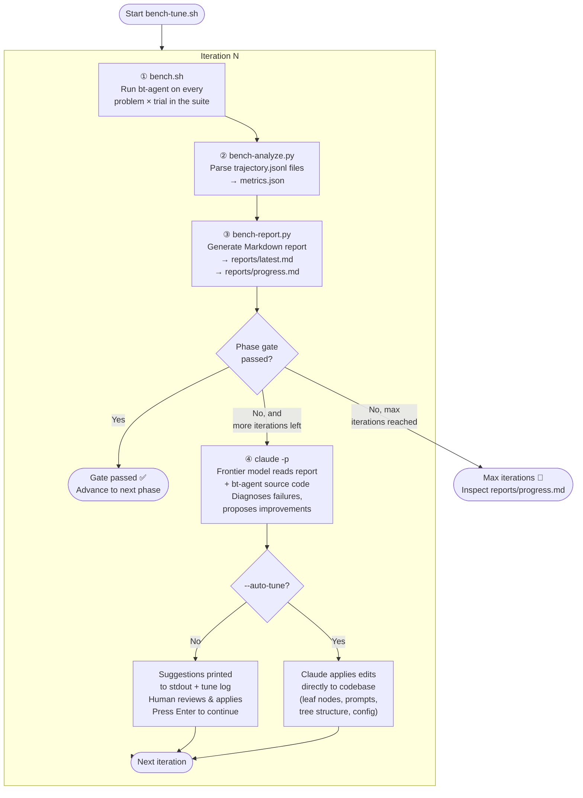

# bt-agent Iterative Improvement Workflow

This document describes the complete workflow for running benchmarks, collecting results,
and iteratively improving the bt-agent using a frontier model as the optimizer.

---

## Required Preflight

Run these checks before `bench.sh` or `bench-tune.sh`:

```bash
# 1) LM Studio reachability
curl -sS http://127.0.0.1:1234/v1/models

# 2) Smoke benchmark
./scripts/bench.sh --suite suites/phase1.yaml --tag preflight-smoke --runs-per-problem 1
```

Preflight pass criteria:
- LM Studio endpoint responds and includes the expected model id (default `qwen/qwen3-14b`).
- Smoke run completes end-to-end and writes:
  - per-trial `result.json`
  - run-level `results.json`
  - run-level `metrics.json`

If running in a sandboxed agent environment, access to `127.0.0.1:1234` may require escalated permissions.

---

## Two Loops

There are two distinct working modes:

| Mode | When to use | Scripts |
|------|-------------|---------|
| **Dev loop** | Debug a single problem interactively | `run-problem.sh` → `collect-logs.sh` |
| **Bench-tune loop** | Systematically improve the agent across a full phase | `bench-tune.sh` (orchestrates all other scripts) |

---

## Dev Loop — Interactive Debugging

Use this when you want to run a single fixture and inspect the trajectory in detail.

```bash
# Pick a problem with fzf, run bt-agent, save formatted logs
./scripts/run-problem.sh

# (Optional) Re-format logs from a previous run
./scripts/collect-logs.sh --run-dir runs/<problem>-<timestamp>/
```

### Scripts in the dev loop

**`run-problem.sh`**
Presents an fzf menu of all `tests/fixtures/*/problem.yaml` files.
After selection, initialises a fresh git repo in `runs/<slug>-<ts>/`, copies the
fixture source files, runs `bt-agent`, then calls `collect-logs.sh` automatically.

**`collect-logs.sh`**
Reads `trajectory.jsonl` from the most recent (or specified) run directory and
renders each node tick as a human-readable line. Optionally interleaves LM Studio
server logs (request/response timing, token counts). Saves output to
`runs/<id>/formatted-log.txt` when `--run-dir` is given.

**`run-info.sh`**
Internal helper (used by the `/run-report` skill). Finds the most recent run
directory and can print the run path, formatted log, `problem.yaml`, or `git diff`.

---

## Bench-Tune Loop — Iterative Phase Improvement

This is the main improvement loop. `bench-tune.sh` orchestrates four sub-scripts
in sequence, iterating until the phase success gate passes or `--max-iterations` is
reached.

Important: do not tune on partial/aborted runs. If any infra or harness error prevents
`metrics.json` generation, treat the iteration as invalid and fix infrastructure first.

```bash
# Run up to 3 iterations, review Claude's suggestions manually before each re-run
./scripts/bench-tune.sh --suite suites/phase1.yaml --max-iterations 3

# Fully autonomous: Claude reads results and applies code changes without prompting
./scripts/bench-tune.sh --suite suites/phase1.yaml --max-iterations 5 --auto-tune
```

### Iteration diagram



### Scripts in the bench-tune loop

**`bench-tune.sh`** — *Orchestrator*
Drives the full iteration loop. Accepts `--suite`, `--max-iterations`, `--auto-tune`,
`--model` (for bt-agent), `--runs-per-problem`, and `--dry-run`. Writes a
timestamped tune log to `reports/tune-<tag>-<ts>.log`.

---

**`bench.sh`** — *Step 1: Batch runner*
Reads the suite YAML (`suites/phase<N>.yaml`), iterates over every `problem × tree × trial`,
and for each trial:
- Copies fixture source files to a fresh `runs/<run-id>/<problem>/trial-N/` directory
- Initialises a git repo and commits the initial state
- Runs `bt-agent <tree> --task ... --repo ... --output trajectory.jsonl`
- Captures `diff.patch` (the changes bt-agent made) and writes `result.json`

At the end, writes `manifest.json` and `results.json` to the run directory, then
automatically calls `bench-analyze.py` and `bench-report.py`.

---

**`bench-analyze.py`** — *Step 2: Metrics extraction*
Parses every `trajectory.jsonl` in the run directory. Extracts:
- Success/failure and commit status
- LLM call count, total tokens, prompt vs completion split
- Retry count (how many times `GenerateEdit` ran per problem)
- Failure mode classification (`old_str_not_found`, `syntax_error`, `json_parse_error`, …)
- Per-phase token spend (gather / plan / edit / validate / commit buckets)

Writes `runs/<id>/metrics.json`. Checks the suite's `success_gate` thresholds and
records `passed: true/false`. Generates rule-based `recommendations` from failure patterns.

---

**`bench-report.py`** — *Step 3: Report generation*
Reads `metrics.json` and `manifest.json`. Generates a Markdown report with:
- Overall pass rate, avg retries, avg tokens, avg wall time
- Phase gate status vs thresholds
- Per-problem pass/fail table
- Failure mode breakdown
- Rule-based recommendations
- Optional delta comparison to a previous run

Writes to `reports/<ts>-<tag>-summary.md`, symlinks to `reports/latest.md`, and
appends a one-line progress row to `reports/progress.md`.

---

**`claude -p`** — *Step 4: Frontier-model optimizer*
The `claude` CLI (Claude Code) is invoked — **not bt-agent**. This is a deliberate
separation: the small local model (bt-agent's subject under test) cannot reliably
diagnose its own failures or propose architectural solutions. Claude reads
`reports/latest.md` plus the bt-agent source tree and can suggest or apply changes to:

| Target | Examples |
|--------|---------|
| `bt_agent/tree/nodes/` | Fix leaf node logic, add retry handling, sharpen error extraction |
| `bt_agent/tree/builder.py` | Add or reorder tree nodes, change Sequence/Selector structure |
| `bt_agent/llm/prompts.py` | Clarify output format, add examples, tighten JSON schema |
| `config/default.yaml` | Adjust temperature, `max_edit_attempts`, context window size |

Without `--auto-tune`: runs with `Read,Glob,Grep` only → prints diagnosis to stdout.
With `--auto-tune`: runs with `Read,Glob,Grep,Edit,Write` and `bypassPermissions` →
applies changes directly to the codebase.

---

## Artifact Layout

```
runs/
  <ts>-<tag>/                    ← one directory per bench.sh invocation
    manifest.json                ← suite, model, config snapshot
    results.json                 ← aggregated pass/fail per trial
    metrics.json                 ← tokens, retries, failure modes, gate result
    <problem-id>/
      trial-1/
        <source files>           ← copied from fixture
        trajectory.jsonl         ← full node-by-node trace
        agent.log                ← bt-agent stdout
        diff.patch               ← git diff from initial state
        result.json              ← {success, exit_code, wall_time_s, committed, …}
        formatted-log.txt        ← human-readable trajectory (if collect-logs ran)

reports/
  <ts>-<tag>-summary.md         ← per-run Markdown report
  latest.md                     ← always points to the most recent report
  progress.md                   ← one-line-per-run cumulative table
  tune-<tag>-<ts>.log           ← full bench-tune.sh output log

tests/fixtures/
  <fixture-name>/
    buggy.py                    ← source file with the bug
    problem.yaml                ← task description + compatible_trees
    test_solution.py            ← pytest oracle (defines "correct")

suites/
  phase1.yaml                   ← problem list + success_gate for Phase 1
  phase2.yaml
  phase3.yaml
  all.yaml                      ← every problem, for regression runs
```

---

## Phase Gating

Each suite YAML specifies a `success_gate`. The loop advances to the next phase only
when all gate criteria pass. This prevents investing effort in harder problems while
a simpler capability tier is still broken.

```yaml
# Example: suites/phase1.yaml
success_gate:
  min_success_rate: 0.90
  max_avg_retries: 2
  max_avg_llm_calls: 4
```

`bench-analyze.py` evaluates the gate after every run. `bench-tune.sh` exits the
loop early with "🟢 SUCCESS GATE PASSED" when it passes.

---

## Quick Reference

```bash
# Preflight before tuning
curl -sS http://127.0.0.1:1234/v1/models
./scripts/bench.sh --suite suites/phase1.yaml --tag preflight-smoke --runs-per-problem 1

# Single problem, interactive
./scripts/run-problem.sh

# Full phase benchmark (one-shot, no tuning)
./scripts/bench.sh --suite suites/phase1.yaml --tag p1-baseline

# View formatted logs for the most recent run
./scripts/collect-logs.sh

# Iterative tuning — manual review between iterations
./scripts/bench-tune.sh --suite suites/phase1.yaml --max-iterations 3

# Iterative tuning — fully autonomous (Claude applies changes)
./scripts/bench-tune.sh --suite suites/phase1.yaml --max-iterations 5 --auto-tune

# Regression check across all phases
./scripts/bench.sh --suite suites/all.yaml --tag regression

# Check cumulative progress
cat reports/progress.md
```

## Bench-Tune Readiness Checklist

Before running `./scripts/bench-tune.sh ...`:

1. LM Studio is reachable at `http://127.0.0.1:1234/v1/models`.
2. Expected model id is present (or set `--model` explicitly).
3. A smoke benchmark completed and produced valid `metrics.json`.
4. `reports/latest.md` corresponds to a complete run (not an aborted run).
5. `pytest tests/unit/ -q` passes in the working tree.
