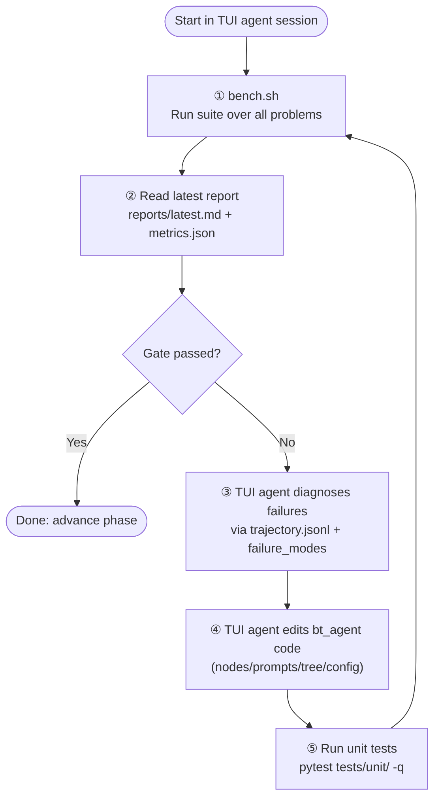

# bt-agent Iterative Improvement Workflow

This workflow is designed to run inside a single TUI coding-agent session (Codex or Claude).
No script under `scripts/` should launch a separate frontier-model subprocess.

---

## Operating Model (Important)

- The TUI agent you started is the optimizer.
- `bt-agent` (small local model) is the subject under test.
- `scripts/` tools run benchmarks and reporting only.
- Tuning edits are done by the same active TUI agent session, not by spawning `claude -p` or any other frontier-agent process.

---

## Required Preflight

Run before any benchmark iteration:

```bash
# 1) LM Studio reachability
curl -sS http://127.0.0.1:1234/v1/models

# 2) Smoke benchmark and artifact check
./scripts/bench.sh --suite suites/phase1.yaml --tag preflight-smoke --runs-per-problem 1
```

Preflight pass criteria:
- LM Studio responds and includes expected model id (default `qwen/qwen3-14b`, unless overridden).
- Smoke benchmark completes and produces:
  - per-trial `result.json`
  - run-level `results.json`
  - run-level `metrics.json`

If running in a sandboxed environment, socket access to `127.0.0.1:1234` may require escalation.

---

## Two Loops

| Mode | When to use | Driver |
|------|-------------|--------|
| **Dev loop** | Debug one fixture in depth | `run-problem.sh` + `collect-logs.sh` |
| **Tune loop** | Improve phase success rate iteratively | Active TUI agent + `bench.sh` |

---

## Dev Loop — Single Problem Debug

```bash
./scripts/run-problem.sh
./scripts/collect-logs.sh --run-dir runs/<problem-run>/
```

Use this to inspect node-level behavior and validate a hypothesis quickly.

---

## Tune Loop — TUI-Agent Driven Iteration

Use this loop directly in your Codex/Claude chat session.

1. Run benchmark:
   - `./scripts/bench.sh --suite suites/phase1.yaml --tag iter-<label> --runs-per-problem 1`
2. Read report:
   - `cat reports/latest.md`
3. Check gate:
   - inspect `runs/<latest-run>/metrics.json` → `success_gate.passed`
4. If gate failed, inspect failures:
   - highest-count entry in `failure_modes`
   - one or two trajectories at `runs/<latest>/<problem>/trial-1/trajectory.jsonl`
5. Edit agent implementation (`bt_agent/tree/nodes/`, builders, prompts, config).
6. Validate harness integrity:
   - `.venv/bin/python -m pytest tests/unit/ -q`
7. Re-run benchmark and repeat until gate passes.

### Auto-Tune Semantics (TUI Session)

`auto-tune` means the active TUI agent applies edits directly in this same session after reading benchmark artifacts.
It does **not** mean launching a new external frontier-agent subprocess.

---

## Iteration Diagram



---

## Script Responsibilities

- `scripts/bench.sh`: batch run fixtures, create run artifacts, invoke analysis/report generation.
- `scripts/bench-analyze.py`: compute metrics, gate status, failure-mode counts.
- `scripts/bench-report.py`: generate Markdown summary and update `reports/latest.md`.
- `scripts/run-problem.sh`: run one fixture interactively.
- `scripts/collect-logs.sh`: produce readable trajectory logs.

No script is responsible for launching a frontier optimizer process.

---

## Artifact Layout

```text
runs/
  <ts>-<tag>/
    manifest.json
    results.json
    metrics.json
    <problem-id>/
      trial-1/
        trajectory.jsonl
        agent.log
        diff.patch
        result.json

reports/
  <ts>-<tag>-summary.md
  latest.md
  progress.md
```

---

## Triage Rule: Infra vs Agent

Do not tune prompts/nodes from incomplete runs.

- Infrastructure failures first (connection errors, missing artifacts, script/runtime errors).
- Agent behavior tuning second (`old_str_not_found`, `json_parse_error`, `syntax_error`, etc.).

---

## Quick Reference

```bash
# Preflight
curl -sS http://127.0.0.1:1234/v1/models
./scripts/bench.sh --suite suites/phase1.yaml --tag preflight-smoke --runs-per-problem 1

# Baseline run
./scripts/bench.sh --suite suites/phase1.yaml --tag p1-baseline

# Inspect latest report
cat reports/latest.md

# Unit tests after edits
.venv/bin/python -m pytest tests/unit/ -q
```
